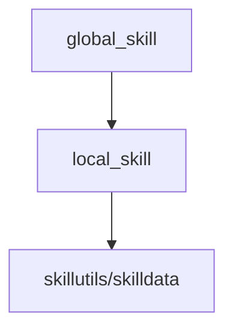

# Skillutils over localskills over globalskills

**Global skills** or otherwise just called skills, form a hierarchy. Global skills are the first step of the hierarchy; They are everything that describes the skill such as its name, its cooldown when used, its run and cancel functions, etc. Under global skills are **local skills**. Local skills are the playerspecific and have methods such as :visible(boolean) and :destroy(). They keep the cooldown and slot of the move. Finally the last step is skillutils/skilldata. These are the individual uses of the skill as objects.

